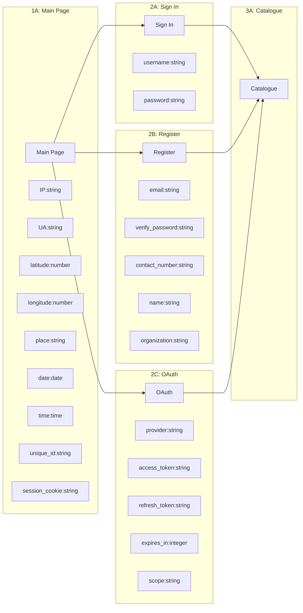

```mermaid
graph LR
 subgraph 1A: Main Page
        1A["Main Page"]
        IP:string
        UA:string
        latitude:number
        longitude:number
        place:string
        date:date
        time:time
        unique_id:string
        session_cookie:string
    end
    subgraph 2A: Sign In
        2A["Sign In"]
        username:string
        password:string
    end
    subgraph 2B: Register
        2B["Register"]
        username:string
        email:string
        password:string
        verify_password:string
        contact_number:string
        name:string
        organization:string
    end
    subgraph 2C: OAuth
        2C["OAuth"]
        provider:string
        access_token:string
        refresh_token:string
        expires_in:integer
        scope:string
    end
  subgraph 3A: Catalogue
        3A["Catalogue"]
    end

    1A --> 2A
    1A --> 2B
    1A --> 2C
    2A --> 3A
    2B --> 3A
    2C --> 3A


  

```
