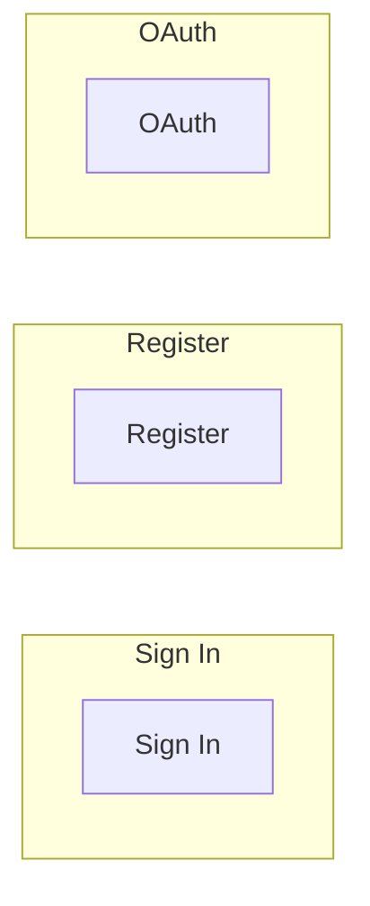

# KIVTECHS FLOW




```mermaid
graph LR
    subgraph Sign In
        2A[Sign In]
        username: string
        password: string
    end
    subgraph Register
        2B[Register]
        username: string
        email: string
        password: string
        verify_password: string
        contact_number: string
        name: string
        organization: string
    end
    subgraph OAuth
       2C[OAuth]
        provider: string
        access_token: string
        refresh_token: string
        expires_in: integer
        scope: string
    end

  

```
