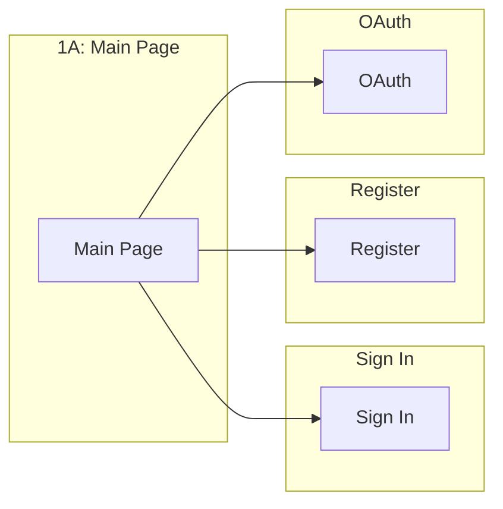
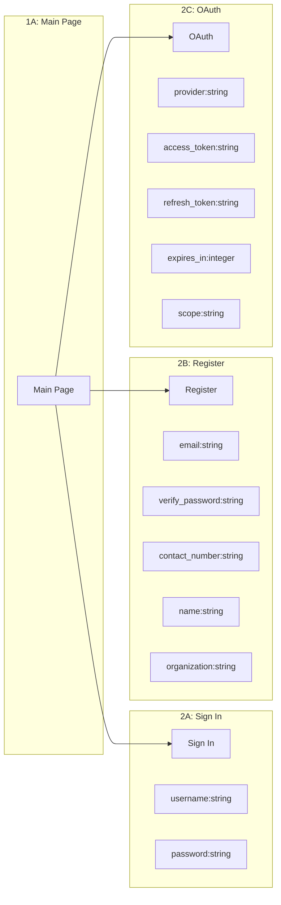

# KIVTECHS FLOW

```mermaid
graph LR
 subgraph 1A: Main Page
        1A["Main Page"]
    end
    subgraph Sign In
        2A[Sign In]
    end
    subgraph Register
        2B[Register]
    end
    subgraph OAuth
        2C[OAuth]
    end

    1A --> 2A
    1A --> 2B
    1A --> 2C
   

```

```mermaid
graph LR
 subgraph 1A: Main Page
        1A["Main Page"]
    end
    subgraph 2A: Sign In
        2A["Sign In"]
        username:string
        password:string
    end
    subgraph 2B: Register
        2B["Register"]
        username:string
        email:string
        password:string
        verify_password:string
        contact_number:string
        name:string
        organization:string
    end
    subgraph 2C: OAuth
        2C["OAuth"]
        provider:string
        access_token:string
        refresh_token:string
        expires_in:integer
        scope:string
    end

       1A --> 2A
    1A --> 2B
    1A --> 2C


  

```
