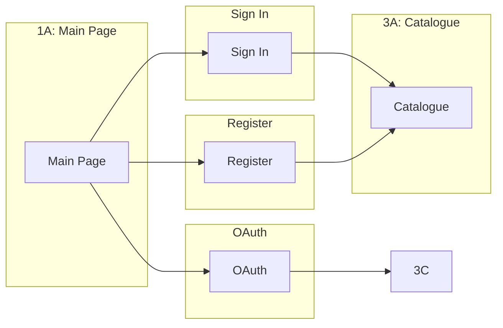

# KIVTECHS FLOW

```mermaid
graph LR
 subgraph 1A: Main Page
        1A["Main Page"]
    end
    subgraph Sign In
        2A[Sign In]
    end
    subgraph Register
        2B[Register]
    end
    subgraph OAuth
        2C[OAuth]
    end
  subgraph 3A: Catalogue
        3A["Catalogue"]
    end

    1A --> 2A
    1A --> 2B
    1A --> 2C
    2A --> 3A
    2B --> 3A
    2C --> 3C
   

```
